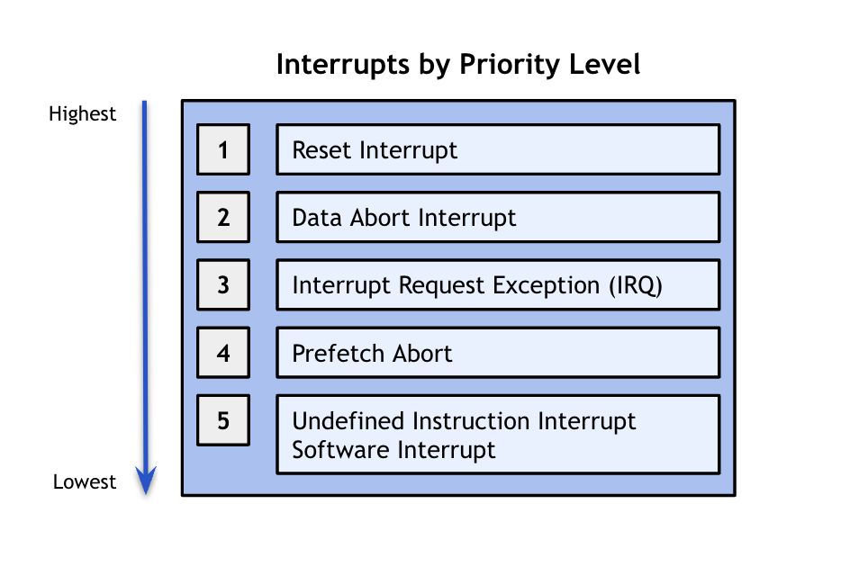

## Interrupts: Redux

#### Student Perspective

This lab felt like one of the first real-world operating system labs, which 
was super exciting! Interrupts are a key part of any functional operating 
system so being able to implement the infratructure to make them work was
very exciting. One of the key things I learned in this lab was the importance
of using _assembly_ as opposed to _C-code_ in certain contexts. 

------------------------------------------------------------------------------

#### Key Points from the Lab

##### 1. The Benefits of Assembly

For most of us, our last tangible experience with assembly was in CS107 when 
doing Binary Bomb/SecureVault. The resulting relationship with assembly is either one of
love or one of hate. In this lab, we learn the importance of using assembly, 
and why sometimes we have no other option _but_ to use assembly. There is some
functionality that it is simply not possible to express in C. In the case of
interrupts, it's important to write them in assembly in order to be sure that
we preserve all registers correctly. 

In the case of interrupts, this is especially the case because we need to 
work with special registers that are otherwise not available in C, and we 
need to guarantee that instructions execute in the order that we want them
to. In the case of interrupts, we need to be able to access stack pointers 
and registers.

With standard C-code, we can't guarantee that the compiled version of the code
is exactly what we expect it to be. This is because, at times, the compiler will
try to optimize code and be more efficient. In most of the programs we have 
written thus far, this isn't an issue. However, as we progress through the
code, we will need to rely on assembly more in order to be able to write 
functional low-level code. 

##### 2. Handling Different Types of Interrupts

In our implementation, we handle interrupts using an interrupt table with 
different branches for the different types of interrupts we might encounter. 
Here is the interrupt table inside of `interrupts-asm.S`:

    .globl _interrupt_table
    .globl _interrupt_table_end
    _interrupt_table:
      ldr pc, _reset_asm
      ldr pc, _undefined_instruction_asm
      ldr pc, _software_interrupt_asm
      ldr pc, _prefetch_abort_asm
      ldr pc, _data_abort_asm
      ldr pc, _reset_asm
      ldr pc, _interrupt_asm

One of the key benefits of this type of implementation is that we can 
leverage assembly in order to ensure that interrupts are implemented
correctly. However, one of the key disadvantages is that we would need to
modify this interrupt table and the surrounding `.S` file manually every 
time we want to add a new type of interrupt. 

As you may notice, there are many different types of interrupts included
in our `_interrupt_table`. As part of this redux, we will go through these
different types of interrupts and when each type of interrupt would be 
triggered. Here is a brief summary of what each entry in the interrupt table
corresponds to: 

    -`_reset_asm`: this resets the state of the ARM processor such that 
    after a `_reset_asm`, the ARM processsor begins execution at address
    `0x00000000` or `0xFFFF0000` in Supervisor mode with interrupts disabled. 
    
    -`_undefined_instruction_asm`: this occurs when the execution of an 
    undefined instruction (i.e. unimplemented) occurs. The ARM processor 
    determines whether an instruction is undefined based on whether the 
    coprocessor recognizes an instruction or not. Whenever the ARM processor
    is about to execute a coprocessor instruction, it waits for any external 
    coprocessor to acknowledge that this instruction can actually be executed. 
    If no coprocessor responds, this this instruction is considered to be
    undefined, and an Undefined Instruction exception occurs. 
    
    -`_software_interrupt_asm`: this occurs when a program running at the user
    level generates and exception condition, and then enters into supervisor mode. 
    (You will learn more about the distinction between user mode and supervisor
    mode in a later lab: `11-user-processes`). A software interrup allows a user 
    program to communicate with the kernel or to invoke system calls, especially 
    during error or exception handling.
    
    -`_prefetch_abort_asm`: this occurs when there is a memory error associated 
    with an instruction fetch. (More generally, an abort is an exception that 
    indicates to the operating system that the value associated with a memory access 
    is invalid.) A prefetch abort (as the name inidcates) occurs _before_ the 
    instruction is actually executed. Thus, a prefetch abort (meaning an abort 
    resulting from an invalid memory access) will not _always_ lead to an interrupt. 
    Instead, it will only lead to an interrupt if, indeed, that instruction gets 
    ultimately executed. For instance, if the processor takes a different branch 
    and does not execute the instruction, then the prefetch abort interrupt does
    not occur. 
    
     -`_data_abort_asm`: this occurs when there is a memory error associated 
    with a data access. This normally happens when a program is trying to read
    or write to an illegal memory location. 
    
    -`_interrupt_asm`: this occurs when there is an interrupt that originates from
    the hardware. A hardware interrupt is used to handle events such as recieving
    datat from a modem or network card, key presses, or mouse movements. 

Given the many different types of interrupts that exist, the processor needs some
way of dealing with multiple interrupts at the same time. To do this, the processor
sorts interrupts based on their **priority**. Interrupts are assigned relative 
priorities and are serviced in that order. 

Here is a diagram outlining the relative priorities of the interrupts which we are
included in our `_interrupts_table`:

<table><tr><td>
  
</td></tr></table>

