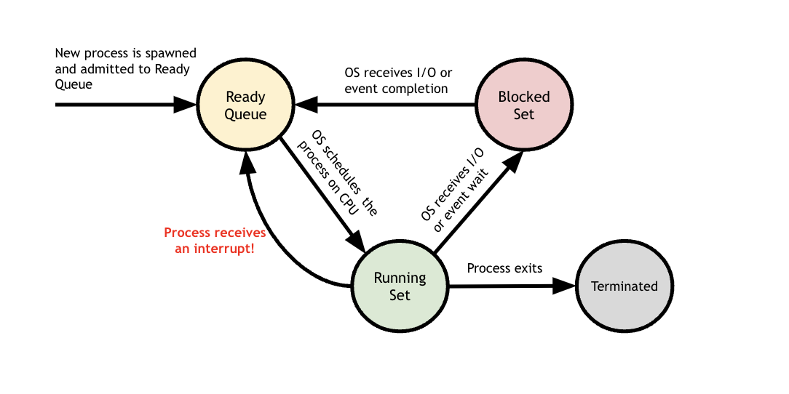
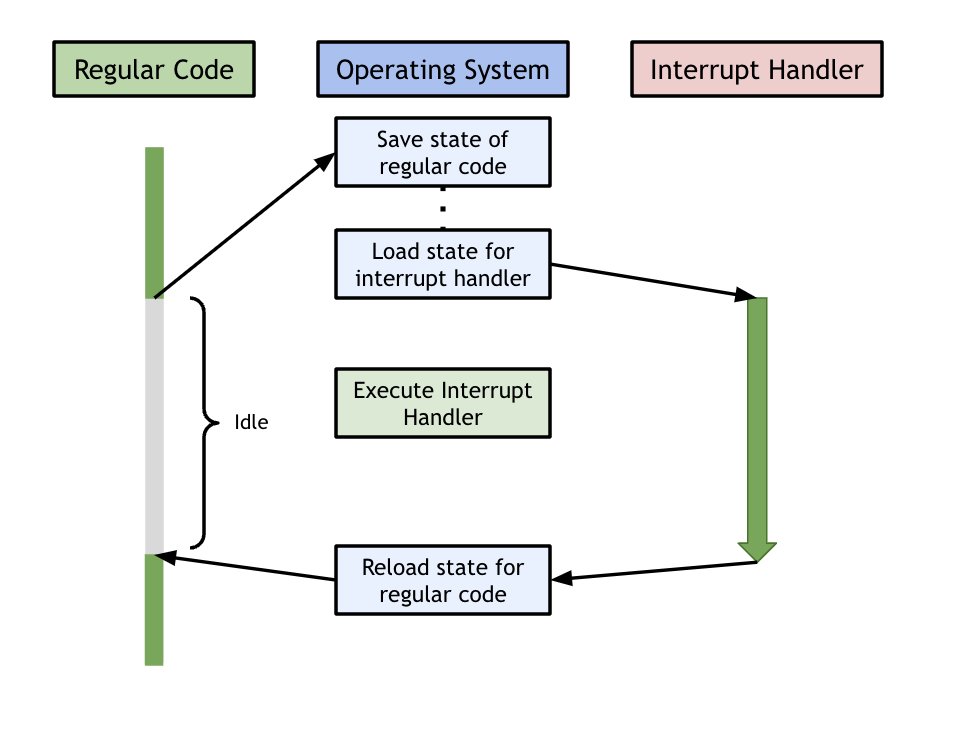
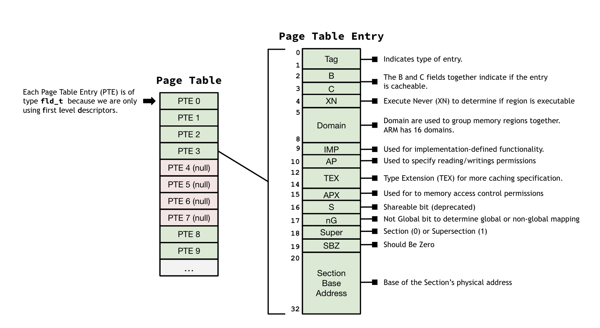
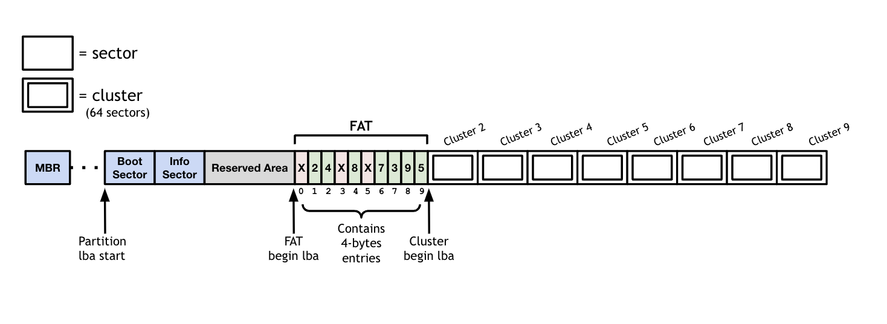
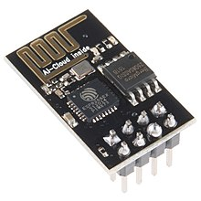
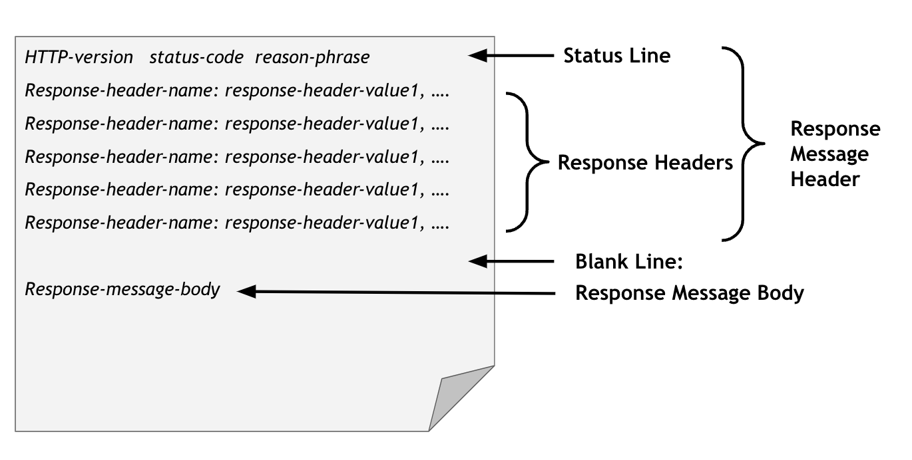

## Full Compilation of Introductions

### 1-gpio

The first lab was just setup.  Now we get to the fun part: you'll use
the Broadcom document (`../../docs/BCM2835-ARM-Peripherals.annot.PDF`)
to figure out how to write the code to turn the GPIO pins on/off yourself
as well as reading from them to get values produced by a digital device.
You'll use this code to blink an LED and to detect when a capacitive
touch sensor is touched. 

This lab is important as it's our first real 
introduction to using a hardware document in tandem with writing code
to control the pi. It's also our first use case for reading/writing to 
device memory. `GET32` and `PUT32` are your friends, and will be this whole quarter!

It's in the PRELAB, but please be sure you have read [GPIO and device memory crash
course](../../guides/GPIO.md) in the guides directory, and understand the examples.
This document does a good job of jumpstarting the work you'll do today. 

By the end of this lab, you'll have written code to toggle
a given GPIO pin on your pi between input/output, and on(high)/off(low).
Future labs will then be able to rely on these functions you've written
to do more exciting things!

### 2-cross-check

A goal of this course is that you will write every single line of
(interesting) low level code you use.  A good result of this approach
is that you will understand everything and, unlike most embedded or
operating systems courses, there will not be a lot of opaque, magical
code that you have no insight into, other than a sense of unease that it
does important stuff beyond your ken.

An obvious potential result of this strategy is that since you are writing
all of the code your system depends on, a single bug can make the rest of 
the quarter miserable.

Today's lab uses simple implementations of several powerful ideas to
check if your `gpio.c` code from last lab has any bugs.

After completing the lab you will be able to check that your `gpio.c`
code is effectively equivalent to everyone else's in the class by
tracing all reads and writes it does and comparing them to everyone
else's implementation.  If even one person gets it right, then showing
equivalence means you got it right too.  Conveniently, this will also
allow you to automatically detect if any subsequent modifications you
make break the code.

This lab is going to be the first time we leverage checksums as a 
cross-checking test mechanism for code correctness. We will use the
`cksum` Unix command, which is a command that generates a checksum value 
for a file or stream of data. The `cksum` command will continue to pop 
up in future labs as a verification tool so gaining an understanding
_now_ for why this method of verification is useful to us, will help 
you later on as well! In short, `cksum` generates a 
[CRC](https://en.wikipedia.org/wiki/Cyclic_redundancy_check) hash for
a given file. We'll save our test outputs to `*.out` files and then
run `cksum` on those. This will generate a single number that we can 
use to ensure that everyone's read and write calls match up (i.e. 
everyone's `cksum` values are identical).

This lab will also ask you to generalize your `gpio.c` code from last
week. In particular - recall the purpose of the GPIO Function Select
Registers (FSELn, p91-92 of Broadcom doc). We used that register in
the gpio lab to set a pin to input or output functionality, however 
pins can also be set to various alternate functions. Today, 
you will write code that decomposes that logic into the more general 
`gpio_set_function()` and verify that the function you've written is
correct through cross-checking. 

After checking off today, you can feel confident that your code is
_at least as correct_ as everyone else's in this class!

### 3-bootloader

The next few labs are constructed to remove all magic from your pi setup
by going downward and having you write and replace all of our code.
The only code running when you boot (and the only code you run to boot)
will either be stuff you wrote, or simple library routines we give you
(which you can also replace!).

Today's lab is a big step in that direction.  You will:

  - Write your own bootloader (both the Unix and pi side) to replace
     what we used last lab (i.e., `pi-install` and `bootloader.bin`).
     
#### What is your "bootloader"?
Recall from the previous lab, that you were given a bootloader binary (a pre-compiled program),
and copied it to your SD card as `kernel.img` (the pi's default kernel location).
This "pi side" of the bootloader was then able to spin in a loop while
waiting for your laptop to use the command `pi-install` (aka the
"unix side" of this setup), to send 
a program to the pi via the UART-TTL. At the end of this lab,
you'll have replaced both sides of the bootloader setup with your
own code! A few more details:


When the spinning "pi side", successfully receives the program, it stops spinning, copies the 
received program into pi memory, and jumps to it to begin executing
the program. In short, our "bootloader" is going to be the connection
between unix programs you write on your laptop, and the pi device that
we want those programs to run on!

The following is a diagram to help you begin to visualize the method
of communication between your bootloader's unix side and pi side. There will be 
more details further along in the lab!


In the next lab you'll continue to eliminate opaque staff code.
You will write your own versions of the low-level device
code your bootloader needs to control the UART hardware (what talks to
the TTY-USB device connecting your pi and laptop).  You will then be
able to drop in your `gpio.o` and your `uart.o` and replace almost all
of our hardware-level code.


### 4-uart

By the end of this lab, you'll have written your own device driver for
the pi's mini-UART hardware, which is what communicates with the TTY-USB
device you plug into your laptop.  This driver is the last "major" piece
of the pi runtime that you have not built yourself.  At this point, ideally you can look at each line of code in the system, and should
know why it is there and what it is doing.  Importantly you have
reached that magic point of understanding where: there is nothing else.

#### Understanding the UART (extremely cursory)
UART - Universal Asynchronous Receiver/Transmitter - is a serial communication
protocol (protocol for sending bits of data serially, one at a time). Typically,
this protocol sends one byte of data at a time, and packages it in a frame structure (see diagram below).
Recall, from last lab, that we noted that a program could be sent from your laptop
to the pi side of the bootloader via the UART. The UART handles serial packets of data traveling in both directions (receive/transmit) between the pi and laptop via the TTYUSB.

Common frame structure:
- START bit: Always low. Indicates serial communication has begun.
- Data bits packet: Always follows start bit. Typically 8-bit data packet, but can range.
- STOP bit: Always follows data packet, high. Indicates end of frame.


The pi uses a mini-UART which is mapped to two gpio pins for tx/rx (transmit/receive).
Today you'll write code to initialize this UART in the correct configuration (frame size, 
[baud rate](https://en.wikipedia.org/wiki/Baud)), as well
as read received data, and write data to transmit!

This lab will build off of the experience you gained in the `gpio` lab
while working with the Broadcom doc. We will once again be leaning
heavily on that doc `docs/BCM2835-ARM-Peripherals.annot.PDF`,
and your newfound skills in parsing useful info
from this type of hardware datasheet will be boundlessly useful here!

*NOTE*:
  - Make sure you read through the [mini-UART cheatsheet](miniUART.md)


### 6-interrupts

In this lab, we will be working on implementing **interrupts**, which are
at the heart of operating system design. The kernel is responsible for 
keeping track of processes (which may be running on multiple devices) and
ensuring that they run correctly, and to completion. The kernel's job
ends up becoming that of a master scheduler who is responsible for 
overseeing everything that is happening on the machine. Managing everything
that is going on is no easy task. 

One way to understand process management is to think about process state. 
Process state tracks the _state_ of any given process, and allows the 
kernel to make important scheduling decisions about which process should 
run next. Most importantly, the scheduler needs to decide which process 
should have priority to run. The scheduler by might begin by running one
process--called, say, Process B--but will give priority to another 
process--called, say, Process A--if the second process needs immediate 
attention. In other words, the scheduler can choose to _interrupt_ 
Process A by forcing that process to stop running for the time being. 
The scheduler would do this by moving Process A from the running set to 
the ready queue. Here is a diagram to model this:

<table><tr><td>
  
</td></tr></table>

The key idea with interrupts is that we can manage the execution of 
multiple, concurrent processes by ensuring that processes interrupt
one another whenever they need immediate attention. 

This idea of interrupts can be extended further when thinking about how 
an operating system can manage multiple devices at once. The operating
system needs to keep track of what happens to each of these devices. In 
the case something "important" happens to one of these devices, the OS
needs to know immediately so it can appropriately deal with the event 
that just happened and give priority to this device. 

An operating system could try to constantly check what it is happening 
to each of the various devices using a technique known as polling, but 
the system would end up wasting all its time on these checks which 
would make these checks fruitless. If the OS only checked the status 
of these devices periodically then it would only learn about important
changes in the devices well after they happened. Interrupts solve this 
problem by ensuring that the OS can conduct its normal operations, and
that it will be interrupted as soon as an interesting event happens on 
a device it cares about. 

Of course, there are many different types of "interesting" events that
could happen on a device or to a process. When an interesting event does 
happen, the OS wants to know exactly what it should do in response to 
the event that just happened. This is where the idea of an interrupt
handler comes into play. 

An **interrupt handler** is a piece of code associated with a specific
interrupt condition. The interrupt handler is responsible for responding
to the event that just happened by performing the operations that are
necessary in order to service the interrupt. For instance, a timer 
interrupt (which happens when a given amount of time elapses) will 
require a different response than an exception interrupt (which happens
when something goes wrong in a program, such as when we divide by zero). 
Using an interrupt, the OS can ensure that when something important 
happens, it can interrupt the normal code that is running, run the 
interrupt handler for the event that just happened, and then jump back
to the normal code that was running before. 

Interrupts also permit you to write code that may not complete promptly, by giving
you the ability to run it for a given amount, and then interrupt
(pre-empt) it and switch to another thread of control. Operating systems
and runtime systems use this ability to make a pre-emptive threads
package and, later, user-level processes.  The timer interrupt we do
for today's lab will give you the basic framework to do this.

Traditionally interrupts are used to refer to transfers of control
initiated by "external" events (such as a device or timer-expiration).
These are sometimes called asynchronous events.  Exceptions are
more-or-less the same, except they are synchronous events triggered by the
currently running thread (often by the previous or current instruction,
such as a access fault, divide by zero, illegal instruction, etc.)
The framework we use will handle these as well; and, in fact, on the
ARM at a mechanical level there is little difference.

Like everything good, interrupts come at a cost: this will be our
first exposure to race conditions.  If both your regular code and the
interrupt handler read / write the same variables, you have a problem. 
You can have race conditions where both the regular code and the interrupt
handler can overwrite each other's values. In order to avoid this problem, 
we need to save any important values from the regular code that was 
executing, before we switch to the code in the interrupt handler. This
"saving-before-switching" idea is the idea behind what is known as a 
**context switch**. In a context switch, we switch from one piece of code
and all of its relevant variables to another piece of code and all of 
its relevant variables. For this lab, we will be context switching 
between the context of the regular C code and the context of the 
interrupt handler. Here is a diagram illustrating this:

<table><tr><td>
  
</td></tr></table>

### 7-device-interrupts

In today's lab, we will build off of the previous lab where we implemented
"general" interrupts. In today's lab, we will focus specifically on device 
interrupts.

When implementing a real operating system, you'll want to be able to: 
  1. Get interrupts from GPIO pins.
  2. Buffer input and output.

We'll build both today.

For interrupts from GPIO pins, our task is simple: we will want to detect
when the input transitions from 0 to 1 or from 1 to 0. This transition 
from 0 to 1 is known as a "rising" edge, while the transition from 1 to 0
is known as a "falling" edge. In order to ensure that we implement our
GPIO interrupts correctly, we will use a simple version of a logic 
analyzer in order to verify that we implemented everything correctly. To 
do this, we will want to record all of the signals coming from our device
for a given period of time and store them in the queue. Once we do that, 
we can compare them with what we expect to have seen to make sure our
interrupts line up correctly. 

### 9-debug-hardware

Any systems programmer knows the importance of debugging tools such as
GDB and LLDB. These tools are especially useful for debugging memory
corruption errors. In order for these debugging tools to work, they use
exceptions to halt execution whenever a certain line of code is about
to execute, thereby allowing the programmer to inspect that line of 
code and understand what is going on. 

The idea of an **exception** is similar to an interrupt. (In fact, both 
exception and interrupts are unexpected events that disrupt the normal
flow of execution. The main difference between the two is that an 
exception originates from within the processor while an interrupt 
originates from outside the process). As with an interrupt, whenever
an exception occurs, execution is halted so that the exception can
be handled. The OS will look at its interrupt table (which we have
defined in `interrupts-asm.S` in `libpi/src`) in order to branch to
the right routine based on the type of exception that was recieved. 

The ARM chip we use, like many machines, has a way to trigger two
different types of exceptions, both of which are useful for debugging.
The ARM chip is able to set both breakpoints and watchpoints. 
**Breakpoints** cause a fault when the program counter is set to a 
specific address. In other words, breakpoints allow you to halt 
program execution based on a certain instruction being executed. 
Meanwhile, **watchpoints** cause a fault when a load or store is performed 
for a specific address. In other words, watchpoints allow you halt 
execution flow based on a particular dat access. Watchpoints can be used 
to monitor "write", "read", or "read/write" accesses. For instance, 
watchpoints might be used to track when a variable gets updated, a 
region of the stack is written to, or a particular buffer is read 
from. Together, these two types of faults are used by debuggers to 
run a debugged program at full-speed until a specific location is 
read, written or executed.

In today's lab, we will focus on setting watchpoints and breakpoints. 
Most of you are probably most familiar with breakpoints. We will use 
watchpoints as a way to detect memory corruption efficiently.  As you 
know too-well by now, challenge of bare-metal programming is that we 
have not had protection against memory corruption. By this point in the 
quarter, I believe everyone in the class has had to waste a bunch of 
time figuring out what was causing memory corruption of some location 
in their program. After today's lab you should be able to detect such 
corruption quickly:

   1. Simply set a watchpoint on the address of the memory getting corrupted,
   2. When a load or store to this address occurs, you'll immediately
      get an exception, at which point you can print out the program
      counter value causing the problem (or if you're fancy, a backtrace)
      along with any other information you would find useful.

### 10-low-level

The last few labs have involved writing some pretty tricky code. Today's lab
is more of an "odds and ends" types of lab that covers simple, but very 
important, tricks in low level systems programming. In today's lab, we focus 
on building: 

1. **ATAGS**: ATAGS (which stands for ARM-Tags) are used to carry information from 
   boot code to the kernel. ATAGS are a way to pass useful information such as 
   memory size from one important place (boot code) to another important place 
   (the kernel). For instance, when our hardware (i.e. our pi) boots up, it 
   loads `kernel.img`. (Remember, `kernel.img` is like the "brain" of our pi). 
   The internal bootloader passes parameters to `kernel.img` using ATAGS.

2. **Mailboxes**: The Mailbox Peripheral is a peripheral that facilitates 
   communication between the CPU (Central Processing Unit) and the GPU 
   (Graphics Processing Unit). Mailboxes give the pi a way to send messages
   to the GPU and to receive a response. You can think of a Mailbox as the 
   main entry point into the GPU

3. **Stack Backtraces**: A Stack Backtrace is a report of the actice stack 
   frames at a certain point during the execution of a program. Up until 
   now, whenever you have gotten an assertion error or print a message, you
   only have information about the file, function, and, line, that are 
   directly corresponding to wherever the assertion is at. Without a stack 
   backtrace it can be hard to figure out what is going on given you don't
   have inofrmation about the caller(s). Today, you will write a simple
   backtrace implementation that walks back up the stack and gets the current
   callers. 

### 11-user-process

Today you're going to do a wildly useful trick - equivalence checking
with single stepping - for ruthlessly detecting
subtle operating system mistakes.  It will prove invaluable next week
when we do virtual memory --- a topic that has extremely hard-to-track-down
bugs if you just use "normal" testing of running programs and checking 
print statements and exit codes.

In order to do so we give you:
  1. A trivial operating system (`trivial-os`) that has a single process,
     switches to it, and when it is finished, reboots.

  2. A trivial user-level mode implementation has has three system calls:
     `sys_putc`, `sys_put_hex` and `sys_exit`.

  3. The user level code only communicates with the system level using 
     system calls.

This will start getting you used to user-level vs kernel stuff.  Also,
we need code at user level so (1) single-stepping works and (2) the
addresses are the same for everyone.

#### User-level vs kernel mode
The distinction between user and kernel process privileges is rooted
in a problem of security. When running processes and user programs,
the OS needs to maintain confidence that the currently running process
will not take potentially harmful actions (e.g. overwriting permissions
/memory/other processes). This need is met by designating processor 
**_modes_**. The operating system (or kernel) itself runs in **_kernel mode_**, 
with unrestricted access to privileged operations, such as writing/full 
memory access. A process that is less trusted, or that we simply don't want
to be able to overwrite other processes would instead be run in
**_user mode_**. In user mode, access to privileged operations is restricted.
Typically, if a user process needs to perform a privileged operation (such
as reading from disk, writing, etc...), it will need to use a **syscall** 
(system call). Syscalls allow for the controlled exposure of restricted
operations. If a user mode process were to use a syscall, that syscall
instruction would execute in kernel mode, before switching the process mode
back to user-level and continuing on.


In today's lab, you'll write some assembly to switch to user mode and execute user code.
You'll also implement key parts of a low level equivalence check that will combine single-stepping 
with hashing to check that the user register values you're seeing match up with the rest
of the class. Finally, you'll write code to enable breakpoints (crucial for single-stepping)
and replace our staff version with
your own. This lab builds on the prior interrupts and debugging labs and will 
prepare us to dive into virtual memory.

### 12-vm

A key part of a functioning operating system is a virtual memory system 
that abstracts memory access logic away from the user program. When a 
program accesses memory, it does not know or care where the physical 
memory backing the address is stored. Instead, it relies on the operating 
system and the hardware to work together to locate the right physical address 
and thus provide access to the data it wants. This mapping from physical 
address to virtual addresses is the focus of this lab. 

In this lab, we will implement the necessary infrastructure for a Memory
Managment Unit (MMU). A MMU has _two_ important functions: 
   1. Translating virtual addresses to physical addresses
   2. Controlling memory access permissions

The MMU achieves these two functions in tandem but in this introduction, we 
will try to describe the two functions separately. 

For the first function (translating virtual addresses to physical addresses), 
the MMU translates virtual addresses generated by the CPU into physical 
addresses to access external memory. Translation information resides in a 
translation table located in physical memory. The MMU provides the logic 
needed to traverse this translation table and obtain the translated
address. Translation from a virtual address to a physical address begins 
with a fetching the _First-Level Desriptor_. (More complex virtual memory 
systems also use a Second-Level Descriptor to provide more granularity, but
our system will only use a First-Level Descriptor). Each page table entry 
will map to a single section (whose information is stored in the First 
Level Descriptor) or will be marked as invalid. For this lab, there is a 
`fld_t` struct to store all of the information for a First-Level Descriptor.
At the end, your code should align with the following diagram of how the 
Page Table and Page Table Entries look in the ARMv6 vitual memory system:

<table><tr><td>
  
</td></tr></table>

For the second function (controlling memory access permissions), the MMU 
is responsible for "error checking" memory access in order to prevent 
undesirable behavior, namely faults. In the case that a fault is about to 
happen as a result of memory access, the MMU signal the fault condition 
to the CPU. In general, aborts resulting from data accesses result in data 
aborts and are acted upon by the CPU immediately. Thus, data aborts will 
result when the MMU detects an error. 

In the case that a data abort results from a memory access error, there are 
ultimately two possible outcomes: 1) remedy the error if possible, or 2) 
abort the access request. 

The end goal of this lab will be to get a simple "hello world" version of 
virtual memory working. 

### 13-vm-ops

In order for a virtual memory system to work correctly, the operating system
needs to be able to successfully communicate with the hardware. Even if you 
have a well-designed address translation mechanism (as we now do!), the MMU 
needs to be correctly configured and all of the necessary variables need to
be in the right place. You can think of this lab as getting all the ingredients
in the right place, before following the recipe and cooking the meal. (Our 
last lab focused on curating the recipe, and this lab will focus on getting
the ingredients in the right place in the right quantities.)

Here are the three key steps to correctly configuring the MMU:

   1. Setting up domains. Domains are the primary access control mechanisms 
      for a region of memory. A domain defines the conditions under which a
      memory access can proceed. There are 16 different domains in the ARMv6.
      For setting up the domains, you will manipulate the Domain Access 
      Control Register. 
      
      The relevant routine you will implement for this part is: 
      `void cp15_domain_ctrl_wr(uint32_t dom_reg)`
      
   2. Storing the location of the page table in the right place in memory. 
      In order to do this, we need to set up the page table register and set 
      the Address Space Identification (ASID). The page table register 
      (`TTBR0`) will store the base address of the the page table, so that 
      the MMU knows where to look whenever it needs to do an address
      translation. Thus, in order to complete this step, you will manipulate
      the Translation Table Base Register. 
      
      The relevant routine you will implement for this part is: 
      `void cp15_set_procid_ttbr0(uint32_t proc_and_asid, fld_t *pt)`
      
   3. Turning the MMU on and off, and resetting the MMU. In order for the 
      MMU system to work, we need a way to turn it on and off. For turning 
      the MMU off and on, we will manipulate the CP15 Control Register. For
      resetting the MMU, we essnetially want to return the MMU to a "default"
      state. To do this, we will simply wipe the MMU's memory by clearng
      the caches. 
      
      The relevant routines you will implement for this part are: 
      `void mmu_reset(void)`, `void mmu_disable_set_asm(cp15_ctrl_reg1_t c)`
      and `void mmu_enable_set_asm(cp15_ctrl_reg1_t c)`

This lab can seem very intimidating at first, especially given the sheer 
amount of assembly that needs to be written. However, one way to break 
this lab down is to remember that you will only be modifying three registers:
the Domain Access Control Register, the Control Register, and the Translation
Table Register. When modifying these registers, you only have two options: 
reading,cand writing. Ultimately, this limits the set of possible things 
you can do.

### 14-process+vm

Though virtual memory can be thought of as a standalone system, there 
needs to be an effective way to incorporate the logic of virtual memory 
into the OS so that the VM system works seamlessly. In this lab, we verify
that the VM code we wrote in the previous two labs works for context 
switching using a real process structure. A **context switch** occurs when
we switch from one process to another. In order to context switch 
successfully, we need to make sure that that we store all of the state of 
the current process so that it can be restored and resume execution at a 
later point. Thus, the key to a successful context switch is making sure
we store and save all relevant state variables. To do this, we will make 
use of a procces structure to store all of the relevant information for a 
given process in a `struct`. 

Once we have stored all infromation successfully, we will need to implement 
a routine that actually takes care of the context switch itself. This routine
will have a pointer to the struct representing the next process that needs 
to run, and then will process to load up all of the relevent information for 
this new process so that it can run. 

### 15-fat32

Diagram:
<p float="left">
  
</p>


#### 16-esp8266

Today's lab is about setting up a simple networking protocol to connect your 
pi to your laptop _or_ to connect your pi to another pi. The **ESP8266** is 
a wifi SOC ("system on a chip") that has a built-in TCP/IP networking software.
Simply put, this means that all of the components needed to run a bare-bones 
wifi network are found on the ESP8266 chip itself. Thus, the ESP8266 is a cheap, 
reasonable way to add wireless connectivity to various projects assuming they 
don't need extremely low latency or high bandwidth. You can use a ESP82666 chip 
to: be a DHCP server (which is responsible for assigning wireless IP addresses), 
be a web server, and to communicate using TCP or UDP. There are variest of 
ESP8266-based boards. We will be using the ESP-01 variant, which is the first
and simplest board using the ESP8266, and costs under three dollars. Here is what
the ESP8266 looks like:
<p float="left">
  
</p>

In order to program our ESP8266 so that it can communicate with our computer, we 
will be using the **`AT` Commands**, which means will communicate with the ESP8266
by sending it human-readable character string commands. The first token of each of
these commands will be `AT` (hence the name). For instance, to start a TCP connecion,
we will send a `AT+CIPSTART` command to the ESP to tell it to _start_ the connection.
In order for our ESP to successfully communicate with the pi, we need to use the 
same 8n1 UART protocol that we have been using throughout this course. 

#### Addition to 16-esp8266 lab: Part 3: run a web server through your esp.

To run a web server through your ESP, we will want to use the HTTP protocol to 
communicate with a browser. The general cycle of an (extremely simplified) HTTP 
request is the following:

1. Browser opens a TCP connection to the server. In this case, the server is 
   our program running `server.c`.
3. Browser sends request specifying what it want. 
4. Server responds based on the browser's request. Normally, this response will
   be fetching the browser's requested resource. When the server responds, it
   must use the HTTP protocol. 
5. Finally, server closes the connection. (Smarter web servers would keep the 
   connection alive to see if the browser has any other requests, thereby 
   avoiding the overhead of opening a TCP connection.)


In terms of the code you have to write, you will want to make a copy of your
code from `1-ping-pong` so that you can modify `server.c`. The key changes
you will want to make is that after waiting for a connection to come in, you 
will want to: 

1. Wait for a cient to send a request. 
2. Send back a HTTP response. 
3. Close the connection. This prevents the browsers from being clever (they'll 
   try to keep the connection alive to make future requests faster, which messes 
   up our loop. So we just close the connection after each response.) You can 
   close the connection by sending the following command to the AT: 
   `AT+CIPCLOSE=<ID>`, where <ID> is the connection/channel ID.

Once you get this running, you should be able to connect to your AT's WiFi network 
from your computer and visit http://192.168.4.1:4444. You should see a message from 
your web server.
	
For sending a HTTP response back to the client, you will want to use the HTTP
protocol. Here is an outline of what a HTTP response looks like: 

<table><tr><td>
  
</td></tr></table>

For convenience, you can use the following valid HTTP response
	
```
HTTP/1.1 200 OK
Content-Type: text/html
Content-Length: 22

<h1>Hello, world!</h1>
```

